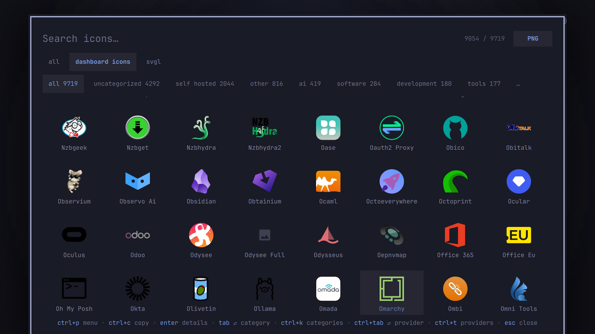

# Omiru

Search the [svgl.app](https://svgl.app) and [Dashboard Icons](https://github.com/homarr-labs/dashboard-icons) logo libraries and copy logos to the clipboard — an overlay for the Omarchy shell.



## Install

```sh
omarchy plugin add https://github.com/ussego/omiru.git --enable
```

## Usage

```sh
omarchy-shell shell summon ussego.omiru '{"query":"git"}'
```

- Type to filter by name; both providers are searched together (Dashboard Icons first, then SVGL).
- **Enter** opens the detail view, **Ctrl+C** copies the active action and closes (right-click copies directly).
- **Tab / Shift+Tab** cycle top categories, **Ctrl+K** opens the full category list.
- **Ctrl+Tab / Ctrl+Shift+Tab** cycle providers; **Ctrl+T** enables/disables providers (chip row: left-click filter, right-click disable); **Delete** toggles the active provider.
- Detail view: **Ctrl+F** cycles the type (`svg | png | webp`), **Tab** cycles the copy action, **1-9** picks one, **v** cycles color variants, **w** opens the website, **Esc** goes back.
- **Ctrl+P** opens a command palette (refresh catalogs, clear cache, …); **Ctrl+R** re-fetches catalogs; **Esc** clears the search or closes.

Summon payloads: `query`, `category`, and `provider` pre-select those on open.

## Keybinding

Add to `~/.config/hypr/bindings.lua`:

```lua
hl.unbind("SUPER + CTRL + G")
o.bind("SUPER + CTRL + G", "Search SVG logos", "omarchy-shell shell toggle ussego.omiru")
```

## Providers & configuration

Provider enable/disable is persisted in `~/.config/omarchy/omiru.json` and applied live. The chip row shows only enabled providers; manage all of them (including new ones) in the **Ctrl+T** dialog.

## Removal

```sh
omarchy plugin remove ussego.omiru
```

To also delete all Omiru data (config, catalog cache, logo library):

```sh
rm -rf ~/.config/omarchy/omiru.json ~/.local/state/omarchy/omiru
```

## Dependencies

`curl`, `wl-copy` (wl-clipboard), and `rsvg-convert` (librsvg) — all shipped with Omarchy.